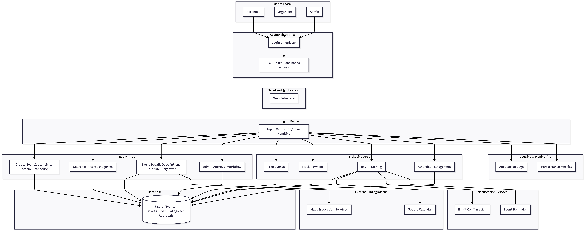

# Evently

Evently is a platform that allows users to create, discover, manage events.
This system supports role-based access control, event moderation, event registration, calendar integration, notifications, and UI for web.
User Roles:
1. **Attendee**
    - Register / Login
    - Browse & search events
    - View event details
    - RSVP / register for events
    - Receive registration confirmations
    - Add event to calendar

2. **Organizer**
    - Create events
    - Upload event details
    - Manage attendees

3. **Admin**
    - Review events
    - Approve / Reject events

## Quick Start

Prerequisites: [Docker](https://docs.docker.com/get-docker/) and (optionally) [`just`](https://github.com/casey/just#packages) for convenience commands.

**1. Create the backend env file** from the template:

```bash
cp backend/.env.example backend/.env
```

Docker Compose reads `backend/.env` for MongoDB credentials.
Note: Any root-level `.env` / `.env.example` file (if present) is not used by this Docker Compose workflow and can be ignored.

**2. Start the full stack:**

```bash
just up          # or: docker compose up --build
```

This starts MongoDB, Redis, the FastAPI backend (with sample data), and the Next.js frontend:

| Service  | URL                        |
|----------|----------------------------|
| Frontend | http://localhost:3000       |
| Backend  | http://localhost:8000       |
| MongoDB  | mongodb://localhost:27017   |
| Redis    | redis://localhost:6379/0    |

The frontend container uses two API base URLs:
- `NEXT_PUBLIC_API_URL=http://localhost:8000` for browser requests
- `API_INTERNAL_URL=http://backend:8000` for server-side Next.js requests inside Docker

**3. Stop / reset:**

```bash
just down        # stop all services
just reset       # stop and wipe the database volume
```

## Local Development

For development with hot reloading, run services outside Docker. Additional prerequisites: [`uv`](https://docs.astral.sh/uv/), [`pnpm`](https://pnpm.io/installation), and [`just`](https://github.com/casey/just#packages).

```bash
# Terminal 1 — start MongoDB + seed + backend (from project root)
just backend

# Terminal 2 — start the frontend (from project root)
just frontend
```

Run `just` with no arguments to see all available commands.

## Admin Access

Admin access is controlled by the `ADMIN_EMAILS` setting in `backend/.env`.
Add a comma-separated list of Google sign-in emails:

```env
ADMIN_EMAILS="admin1@example.com,admin2@example.com"
```

Any signed-in user whose email matches one of those addresses is given the `admin` role automatically.

When an admin signs in, the navigation shows an `Admin Queue` button that links to the pending event approval page at `/admin/events`.

## Architecture

Below is the architecture diagram for the Evently system:


[](https://classroom.github.com/a/xRTHk3Dv)

## Team Members

- Lucas Nguyen
- Wyatt Avilla
- Prajakta Jivanrao Ketkar
- Matthew Bernard
