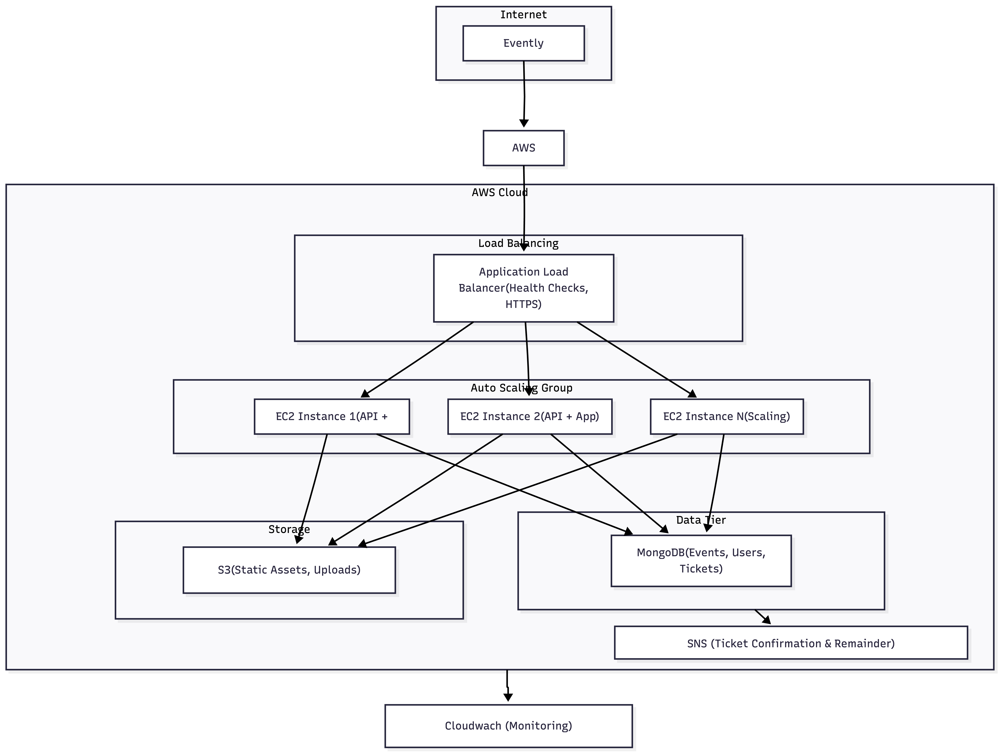

# Evently – Minimal AWS Infrastructure (CDK)

AWS stack: **VPC**, **S3**, **SNS**

## Architecture


| Resource | File | Purpose |
|----------|------|---------|
| **VPC** | `vpc.ts` | Public + private subnets (2 AZs), 1 NAT gateway |
| **S3** | `s3.ts` | Bucket for event assets; encryption, CORS |
| **SNS** | `sns.ts` | Topic for notifications (e.g. event alerts) |


## Prerequisites

- Node.js version 18+ and npm
- AWS CLI configured with credentials

## Deploy

```bash
cd infrastructure/cdk
npm install
npx cdk bootstrap   # once per account/region
npx cdk deploy

To destroy: 
npx cdk destroy
```

Outputs: `VpcId`, `S3AssetsBucket`, `SnsTopicArn`

## Configuration (context)

| Key | Description | Default     |
|-----|-------------|-------------|
| `projectName` | Resource naming | `evently`   |
| `environment` | dev / staging / prod | `dev`       |
| `awsRegion` | Region | `eu-east-1` |
| `s3EnableVersioning` | S3 versioning | `false`     |


## File layout

```
infrastructure/
├── bin/evently.ts       
├── config.ts        
├── types.ts         
├── evently-stack.ts 
├── vpc.ts           
├── s3.ts            
├── sns.ts           
└── outputs.ts       
├── cdk.json
├── package.json
└── README.md
```


